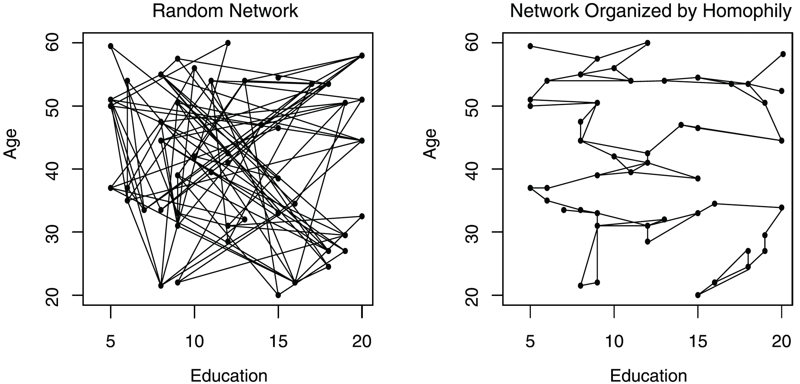

## 1. Introducción

En la práctica es importante considerar los entornos sociales: conversaciones cotidianas, exposición repetida a puntos de vista, normas locales, etc. En otras palabras, *dos individuos con demografías similares pueden diferir en sus actitudes si viven en “mundos sociales” distintos*.

Levantar encuestas con información de redes personales, para tener información de esta **exposición diferencial** entre los encuestados, es desafiante. Este módulo busca *imputar contexto social en encuestas que no midieron redes personales*, basándose en la homofilia en el *espacio de Blau*. Para ello, se utiliza la metodología presentada en:

McPherson, M., & Smith, J. A. (2019). Network Effects in Blau Space: Imputing Social Context from Survey Data. *Socius*, 5. [[10.1177/2378023119868591](https://doi.org/10.1177/2378023119868591)].

El principio es el siguiente: si podemos aproximar la propensión a formar lazos como una función de distancias sociodemográficas, entonces podemos reconstruir, de manera probabilística, un “vecindario social plausible” alrededor de cada respondente y derivar variables de exposición (por ejemplo, el promedio de una actitud política en su entorno imputado). Estas variables de contexto se incorporan luego en modelos de resultados (*outcome models*) para evaluar cuánto “explica” el mundo social probable del encuestado.

La meta metodológica es mostrar que el “término contextual” no solo puede ser estadísticamente significativo, sino también **reducir** en magnitud varios coeficientes demográficos, sugiriendo que una fracción de las brechas demográficas opera a través de diferencias en el mundo social probable del encuestado.

### 1.1. Blau Space y Estructura de Oportunidades

El **Blau space** es un espacio multidimensional donde cada individuo se representa por sus coordenadas sociodemográficas (edad, educación, raza/etnicidad, religión, género, etc.). La probabilidad de interacción entre dos individuos depende de:

(i) cuán cerca están en ese espacio (homofilia) según un vector de distancias sociodemográficas $\mathbf{d}_{ij}$ entre individuos $i$ y $j$:
- Para variables categóricas: $d^{\mathrm{cat}}_{ij} = \mathbb{I}(x^{\mathrm{cat}}_i \neq x^{\mathrm{cat}}_j)$.
- Para variables continuas: $d^{\mathrm{cont}}_{ij} = |x^{\mathrm{cont}}_i - x^{\mathrm{cont}}_j|$.

(ii) la estructura de oportunidades inducida por las distribuciones marginales de atributos.

{fig-cap="Figure 1. Example networks in two-dimensional Blau space."}

### 1.2. Término Contextual

Los coeficientes $\boldsymbol{\beta}$ (calculados usando *case-control design*) cuantifican cómo cambia la propensión al lazo al aumentar la distancia sociodemográfica:

$$
\text{logit}\big(\Pr(Y_{ij}=1)\big) = \alpha + \boldsymbol{\beta}^\top \mathbf{d}_{ij}.
$$

Dado que el intercepto $\alpha$ no es interpretable como densidad real bajo *case-control*, trabajamos con **probabilidades relativas** de lazo, definiendo un peso:

$$
w_{ij} \propto \exp\!\left(\boldsymbol{\beta}^\top \mathbf{d}_{ij}\right), \quad (\text{con } w_{ii} = 0),
$$

que inducen una distribución sobre potenciales alters $j$ que favorece pares cercanos en Blau space. A partir de esta estructura construimos una matriz de pesos $W$ que representa “vecindad social” imputada (no geográfica),
$$
W_{ij} = \frac{w_{ij} \cdot \mathbb{I}(j \in \mathcal{N}_i)}{\sum_{k \in \mathcal{N}_i} w_{ik}},
$$

y luego calculamos el término contextual:

$$
(Wy)_i = \sum_{j \neq i} W_{ij}\, y_j,
$$

donde $y_j$ es la variable de interés del individuo $j$. Intuitivamente, $(Wy)_i$ es una medida de “clima actitudinal” alrededor de $i$.

## 2. Parte A: Replicación ANES 2016 (Democrat Scale)

Para replicar el ejercicio empírico, utilizamos ANES 2016 (pre-election survey), que **no** tiene EGO-net. Imputaremos contexto social y evaluarémos si mejora la explicación de *Democrat Scale* (grado de simpatía/afinidad hacia el Partido Demócrata, reportado por McPherson & Smith) más allá de la demografía. Estimaremos dos modelos:

**Modelo 1:** (demografía)
$$
y_i = \mathbf{x}_i^\top \boldsymbol{\beta} + \varepsilon_i,
$$
donde $\mathbf{x}_i$ incluye edad, educación, género, dummies de raza/etnicidad y religión.

**Modelo 2:** (demografía + contexto social imputado)
$$
y_i = \rho (Wy)_i + \mathbf{x}_i^\top \boldsymbol{\beta} + \varepsilon_i,
$$
donde $\rho$ captura la asociación entre el outcome individual y el clima actitudinal del entorno social imputado.

El foco interpretativo será (i) si $\rho>0$ y es estadísticamente distinguible de cero, y (ii) si la inclusión de $(Wy)_i$ reduce la magnitud de varios coeficientes demográficos, coherente con la lectura “contextual” discutida para Democrat Scale.

### 2.1. Construcción de Pesos (W)

Cargamos datos limpios de la ANES 2016 (preparados en `anes-cleaning.qmd`).

```{r}
#| label: load-anes
#| message: false
#| warning: false

library(dplyr)
library(tidyr)
library(spdep)
library(spatialreg)

# Cargar datos limpios
final_df <- readRDS("data/anes_2016_derived/anes_clean.rds")
cat("Datos ANES cargados. N =", nrow(final_df), "\n")
```

Construimos una matriz de pesos espaciales $W$ basada en la similitud demográfica. Para eficiencia computacional, utilizamos una aproximación *k-nearest* (k=100) en probabilidad.

```{r}
#| label: construct-w
#| message: false

# Demográficos
X_age <- final_df$age
X_educ <- final_df$educ
X_sex <- final_df$female
X_race <- as.integer(final_df$race_raw)
X_relig <- as.integer(final_df$relig_raw)

# Calculamos distancias
D_age <- abs(outer(X_age, X_age, "-"))
D_educ <- abs(outer(X_educ, X_educ, "-"))
D_sex <- abs(outer(X_sex, X_sex, "-"))
D_race <- outer(X_race, X_race, function(x, y) ifelse(x != y, 1, 0))
D_relig <- outer(X_relig, X_relig, function(x, y) ifelse(x != y, 1, 0)) # Mismatch

# Betas de Homofilia (Smith & McPherson 2014-like)
betas <- c(race = -1.9, relig = -1.4, sex = -0.3, age = -0.05, educ = -0.15)

# 1. Calcular Distancias (Blau Space)
D_age <- abs(outer(X_age, X_age, "-"))
D_educ <- abs(outer(X_educ, X_educ, "-"))
D_sex <- abs(outer(X_sex, X_sex, "-"))
D_race <- outer(X_race, X_race, function(x, y) ifelse(x != y, 1, 0))
D_relig <- outer(X_relig, X_relig, function(x, y) ifelse(x != y, 1, 0))

# 2. Predictor Lineal (Log-odds)
eta <- betas["age"] * D_age + betas["educ"] * D_educ + betas["sex"] * D_sex +
    betas["race"] * D_race + betas["relig"] * D_relig

# 3. Pesos Crudos (Probabilidad relativa)
w_raw <- exp(eta)
diag(w_raw) <- 0

# 4. Selección Top-K (K=100) con PESOS (No Uniforme)
N <- nrow(final_df)
K <- 100
neighbors <- vector("list", N)
weights_list <- vector("list", N)

# Seleccionando Top-K vecinos y extrayendo pesos reales
for (i in 1:N) {
    # Ordenar j por peso descendente (indices)
    row_w <- w_raw[i, ]
    ord <- order(row_w, decreasing = TRUE)
    candidates <- setdiff(ord, i)

    # Seleccionar Top K
    top_k_indices <- candidates[1:K]
    top_k_weights <- row_w[top_k_indices]

    neighbors[[i]] <- top_k_indices
    weights_list[[i]] <- top_k_weights
}

class(neighbors) <- "nb"
attr(neighbors, "region.id") <- as.character(1:N)
attr(neighbors, "call") <- match.call()

# 5. Crear Objeto W (Normalizado por fila)
W_listw <- nb2listw(neighbors, glist = weights_list, style = "W", zero.policy = TRUE)
```

### 2.2. Modelos de Regresión

Estimamos dos modelos para explicar la simpatía por el Partido Demócrata ($Y$):

1.  **Modelo 1 (Base):** Solo predictores demográficos ($X$).
2.  **Modelo 2 (Contexto):** Demografía + Lag Espacial ($W y$).

$$ y = \rho W y + X \beta + \epsilon $$

```{r}
#| label: estimate-models
#| message: false
#| results: asis

library(stargazer)

# Fórmula Base
# Usamos dummies explícitas creadas en limpieza
fmla_base <- y ~ age + educ + female +
    race_black + race_hispanic + race_asian + race_native + race_other +
    relig_catholic + relig_jewish + relig_none + relig_other

# Modelo 1: OLS
m1 <- lm(fmla_base, data = final_df)

# Modelo 2: Lag Espacial (OLS para estabilidad)
Wy <- lag.listw(W_listw, final_df$y)
final_df$Wy <- Wy
fmla_lag <- update(fmla_base, ~ . + Wy)
m2_ols <- lm(fmla_lag, data = final_df)

# Resultados con Stargazer
stargazer(m1, m2_ols,
    type = "html",
    column.labels = c("Modelo Base", "Modelo Contextual"),
    dep.var.labels = "Democrat Thermometer (0-100)",
    star.cutoffs = c(0.05, 0.01, 0.001),
    keep.stat = c("n", "rsq"),
    report = "vc*", # Solo coeficientes y estrellas
    omit.table.layout = "n", # Compacto
    no.space = TRUE
)
```

### 2.3. Discusión de Resultados

```{r}
#| label: compare-coefs
#| echo: false

c1 <- coef(m1)
c2 <- coef(m2_ols)

cat("--- Término Contextual ---\n")
cat(sprintf("Spatial Rho (Contexto Social): %.3f\n\n", c2["Wy"]))

cat("--- Comparación de Efectos ---\n")

df_comp <- data.frame(
    Variable = c("Black", "Hispanic", "Catholic", "Female"),
    Model1 = c(c1["race_black"], c1["race_hispanic"], c1["relig_catholic"], c1["female"]),
    Model2 = c(c2["race_black"], c2["race_hispanic"], c2["relig_catholic"], c2["female"])
)

# Calcular reducciones
df_comp$Diff_Abs <- df_comp$Model1 - df_comp$Model2
df_comp$Pct_Reduction <- (df_comp$Diff_Abs / df_comp$Model1) * 100

# Mostrar tabla formateada
knitr::kable(df_comp,
    digits = 2,
    col.names = c("Variable", "Coef M1 (Base)", "Coef M2 (Contextual)", "Reducción Abs.", "% Reducción"),
    caption = "Atenuación de coeficientes demográficos al incluir contexto social."
)
```

Parte de lo que uno atribuiría a “efectos individuales” de raza, religión, educación, etc., en realidad refleja que distintos grupos tienden a habitar contextos sociales distintos.

- El término de contexto social es positivo y estadísticamente significativo en el Modelo 2. La interpretación es que quienes están, en promedio, rodeados por alters que muestran mayor simpatía por los demócratas tienden también a reportar mayor simpatía.

- Para religión, señalan que el contraste entre católicos vs. protestantes permanece significativo pero su magnitud cae de manera importante al controlar contexto; y algo análogo ocurre con “none” (sin religión) versus protestantes.

- En términos de raza/etnicidad, el efecto asociado a Hispanic y a Black también disminuye sustantivamente al introducir el término de contexto. 

- El coeficiente de educación se reduce entre modelos, aunque en menor proporción relativa que varios de los contrastes categóricos. 

Podemos comparar dos escenarios idénticos en demografía, pero con contextos distintos (alters promedio “bajo” vs “alto” en la escala), y ver cómo eso produce un cambio sustantivo en el valor predicho del encuestado, de un orden comparable o mayor que el de los predictores demográficos “clásicos”.

## 3. Parte B: Simulación de Redes Completas (ERGM)

Para experimentos de difusión (Agent-Based Models), extendemos la lógica anterior para simular una red completa ($N \times N$) usando modelos ERGM. Esto nos permite generar topologías coherentes donde la probabilidad de lazo $P(X_{ij}=1)$ está condicionada por la homofilia.

### 3.1. Ejecución Script ERGM

Utilizamos un script dedicado (`02_ATP_network_ergm.R`) que calibra la densidad de la red ajustando el parámetro `edges` mientras mantiene fijos los coeficientes de homofilia derivados de Smith & McPherson (2014).

```{r}
#| label: run-ergm
#| eval: false

# Este bloque ejecuta la simulación
source("02_ATP_network_ergm.R")
```

### 3.2. Análisis de Red Simulada

```{r}
#| label: analyze-sim
#| echo: true
#| eval: false

library(network)
library(sna)
# Cargar red simulada (ejemplo)
sim_net <- readRDS("data/02_ATP_network_ergm/ATP_net_sim_1000_001.rds")
hist(degree(sim_net, gmode = "graph"), main = "Distribución de Grado (Simulada)", col = "tomato")
cat("Densidad:", network.density(sim_net), "\n")
```

## 4. Conclusión

Hemos demostrado cómo el **Blau Space** permite:
1.  **Imputar Contexto:** Enriquecer encuestas recuperando la exposición social latente.
2.  **Simular Redes:** Generar sustratos realistas para modelos de difusión ABM.
